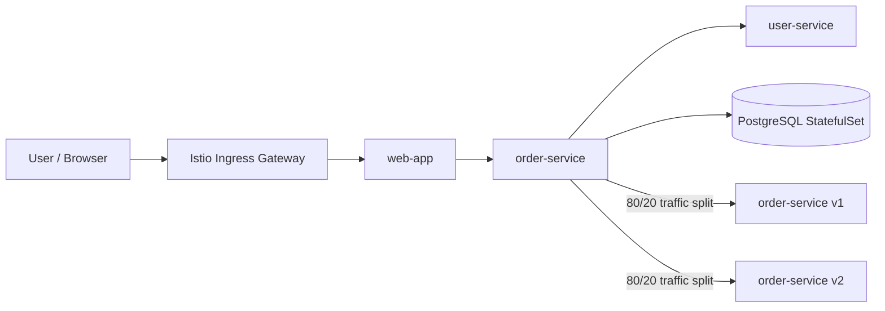
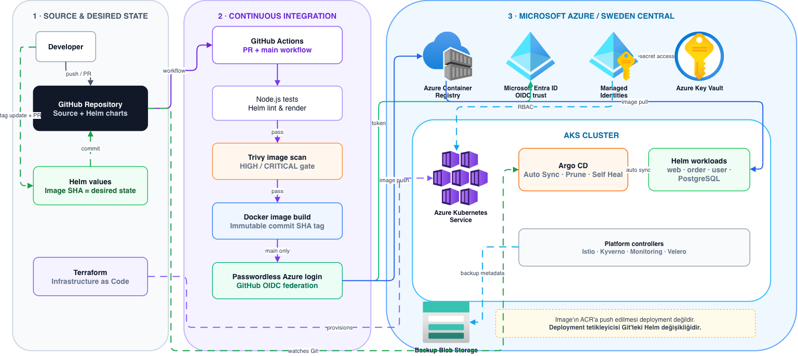
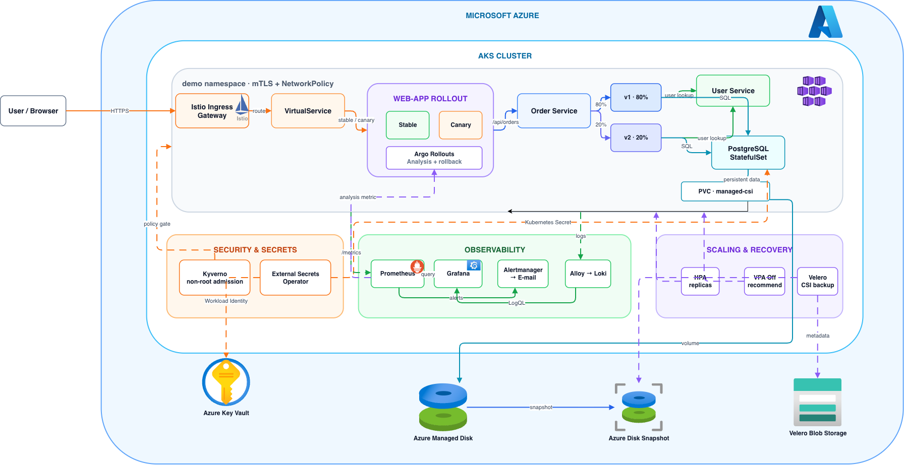
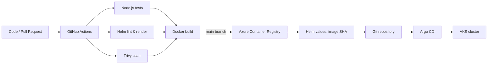
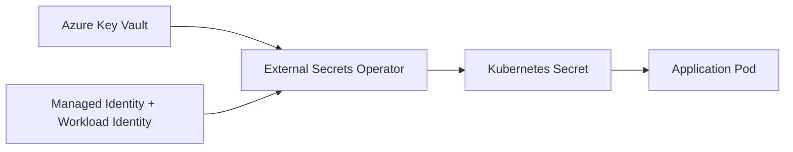
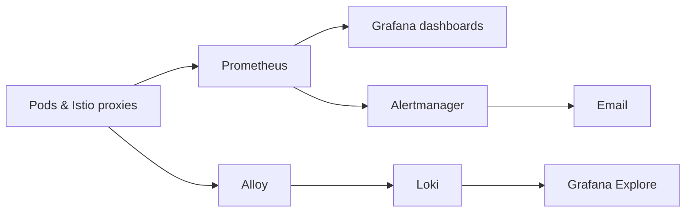

# Cloud Native Order Platform

Azure Kubernetes Service üzerinde çalışan, GitOps prensipleriyle yönetilen örnek bir microservice platformu. Proje; CI/CD, güvenlik, observability, ölçekleme, Infrastructure as Code ve disaster recovery konularını tek bir uygulama üzerinde bir araya getirir.

## İçindekiler

- [Genel Bakış](#genel-bakış)
- [Mimari](#mimari)
- [Uygulama Bileşenleri](#uygulama-bileşenleri)
- [CI/CD ve GitOps](#cicd-ve-gitops)
- [Güvenlik ve Secret Yönetimi](#güvenlik-ve-secret-yönetimi)
- [Observability](#observability)
- [Ölçekleme ve Dayanıklılık](#ölçekleme-ve-dayanıklılık)
- [Infrastructure as Code](#infrastructure-as-code)
- [Dizin Yapısı](#dizin-yapısı)
- [Yerel Çalıştırma](#yerel-çalıştırma)
- [AKS Doğrulama](#aks-doğrulama)
- [Kapsam ve Sınırlamalar](#kapsam-ve-sınırlamalar)

## Genel Bakış

Platform, sipariş akışını yöneten üç Node.js servisi ve PostgreSQL database’inden oluşur. Uygulama local Minikube ortamında geliştirilebilir; production benzeri çalışma ortamı olarak Azure AKS kullanılır.

Temel hedefler:

- Kaynak koddan güvenli container image üretmek ve ACR’a göndermek
- Kubernetes manifestlerini Git’te desired state olarak tutmak
- Argo CD ile otomatik ve izlenebilir deployment yapmak
- Secret, network, admission ve image güvenliğini pipeline ve cluster seviyesinde uygulamak
- Metrics, logs ve alarmları merkezi olarak toplamak
- HPA, VPA, backup ve progressive delivery ile operasyonel dayanıklılık sağlamak

## Mimari

### İstek akışı



Kullanıcı trafiği Istio Gateway üzerinden cluster’a girer. `web-app` API isteklerini `order-service`’e iletir. Order servisi kullanıcı bilgisi için `user-service`’e, kalıcı veri için PostgreSQL’e erişir. Istio, order-service’in v1 ve v2 subset’leri arasında kontrollü trafik dağıtımı yapar.

### CI/CD ve Azure topolojisi

<p align="center">
  
</p>

### AKS runtime platformu

<p align="center">
  
</p>

## Uygulama Bileşenleri

| Bileşen | Sorumluluk | Kubernetes yaklaşımı |
| --- | --- | --- |
| `web-app` | Kullanıcı arayüzü ve API proxy | Helm chart, Istio stable/canary Service, Argo Rollout |
| `order-service` | Sipariş oluşturma ve listeleme | Helm chart, v1/v2 subset, HPA ve VPA |
| `user-service` | Kullanıcı bilgisi sağlama | Helm chart, HPA ve VPA |
| PostgreSQL | Sipariş verilerinin kalıcı saklanması | StatefulSet, PVC, Azure Managed Disk |
| Istio | Ingress, service routing ve mTLS | Gateway, VirtualService, DestinationRule |

Servisler health check endpoint’leri, metrics endpoint’i ve yapılandırılmış JSON loglar sağlar. `order-service` aynı image üzerinden `APP_VERSION` build argument’ı ile v1 ve v2 olarak paketlenebilir.

## CI/CD ve GitOps



### GitHub Actions

`.github/workflows/ci.yml` pull request ve `main` branch push olaylarında çalışır.

- Üç Node.js servisi matrix job ile test edilir.
- Her Helm chart için `helm lint` ve `helm template` çalıştırılır.
- Docker image’ları oluşturulur.
- Trivy, OS ve library seviyesinde `HIGH` ve `CRITICAL` açıkları kontrol eder.
- `main` branch’inde başarılı image’lar commit SHA ile tag’lenerek ACR’a push edilir.
- Azure authentication için uzun ömürlü parola yerine GitHub OIDC kullanılır.

Image push işlemi tek başına deployment başlatmaz. Deployment, image SHA’sını referanslayan Helm values değişikliğinin Git’e gönderilmesiyle başlar.

### Argo CD

Argo CD, repository’deki `main` branch’i cluster’ın desired state’i olarak izler. Helm chart ve GitOps manifestlerindeki değişiklikler AKS’e otomatik olarak uygulanır.

- **Auto Sync:** Git değişikliğini otomatik uygular.
- **Prune:** Git’ten kaldırılan kaynakları cluster’dan temizler.
- **Self Heal:** Cluster üzerinde yapılan manuel drift’i düzeltir.
- **AppProject:** Uygulama ve platform kaynaklarının yetki sınırlarını belirler.

Uygulama chart’ları `helm/`, platform tanımları ise `gitops/` ve `argocd/aks-applications/` altında tutulur.

## Güvenlik ve Secret Yönetimi

### Secret akışı



PostgreSQL ve Alertmanager SMTP bilgileri Git repository’sinde tutulmaz. External Secrets Operator, AKS Workload Identity aracılığıyla Key Vault’tan değerleri okur ve gerekli Kubernetes Secret’larını oluşturur.

GitHub Actions OIDC ile AKS Workload Identity farklı amaçlara hizmet eder:

- GitHub OIDC: CI runner’ın Azure’a bağlanması
- Workload Identity: AKS içindeki pod’un Azure kaynağına bağlanması

### NetworkPolicy

`demo` namespace’i default-deny yaklaşımıyla başlar. Yalnızca uygulamanın ihtiyaç duyduğu akışlara izin verilir:

- Ingress Gateway → `web-app`
- `web-app` → `order-service`
- `order-service` → `user-service`
- `order-service` → PostgreSQL
- Gerekli DNS ve Istio kontrol düzlemi trafiği

Local lab ortamında Calico, AKS’te Azure CNI Overlay ve Cilium network policy enforcement kullanılır.

### Kyverno

Kyverno admission policy, container’ların root kullanıcıyla çalışmasını engeller. Kaynak cluster’a oluşturulmadan önce doğrulandığı için hatalı workload admission aşamasında reddedilir.

### Istio mTLS

`PeerAuthentication` ile `STRICT` mTLS etkinleştirilmiştir. Servisler arası iletişim Istio sidecar proxy’leri üzerinden şifreli ve kimlik doğrulamalı şekilde gerçekleşir.

## Observability



### Metrics

- **Prometheus:** Kubernetes, application ve Istio metrics toplar.
- **PodMonitor:** `order-service` ve `user-service` pod’larının scrape edilmesini sağlar.
- **Grafana:** Target health, request rate, HTTP 5xx ve pod restart panellerini gösterir.

### Alerting

PrometheusRule kaynakları aşağıdaki durumları izler:

- Application target down
- HTTP 5xx oranının yükselmesi
- Pod restart artışı

Alertmanager bu alarmları route ederek e-posta ile bildirir. SMTP credentials Key Vault üzerinden sağlanır.

### Merkezi loglama

Alloy, Kubernetes container loglarını toplayıp Loki’ye gönderir. Grafana Explore üzerinden namespace, application, container veya request ID ile sorgulama yapılabilir. Uygulama loglarında status code, duration ve version gibi alanlar bulunur.

## Ölçekleme ve Dayanıklılık

### HPA ve VPA

- **HPA:** CPU kullanımına göre stateless servislerin replica sayısını artırır veya azaltır.
- **VPA:** `updateMode=Off` ile yalnızca CPU ve memory request/limit önerisi üretir; pod’ları otomatik restart etmez.
- Metrics Server, HPA ve VPA’nın ihtiyaç duyduğu kaynak kullanım verisini sağlar.

HPA replica sayısını, VPA ise pod başına kaynak miktarını yönetir. Aynı alanın birden fazla controller tarafından değiştirilmemesi için controller sorumlulukları ayrılmıştır.

### Velero backup ve restore

Velero ile Kubernetes kaynak metadata’sı ve PostgreSQL PVC’sinin Azure Managed Disk CSI snapshot’ı Azure Blob Storage’a yedeklenir. Restore testi canlı namespace’i etkilememesi için ayrı bir `demo-dr` namespace’ine yapılmıştır.

Restore doğrulamasında:

- Backup ve CSI snapshot’ın tamamlandığı kontrol edilir.
- PVC’nin bağlanması beklenir.
- PostgreSQL diskindeki `PG_VERSION` ve database dosyaları verifier pod ile doğrulanır.

### Argo Rollouts

`web-app` için progressive delivery uygulanır. Trafik stable ve canary Service’lar arasında kademeli olarak aktarılır. Prometheus analysis sonucu başarılıysa rollout ilerler; 5xx oranı yükselirse rollout abort edilerek stable versiyona dönülür.

## Infrastructure as Code

Terraform, Azure altyapısının tekrar üretilebilir şekilde tanımlanmasını sağlar.

Terraform ile yönetilen başlıca kaynaklar:

- AKS cluster ve system node pool
- AKS OIDC issuer ve Workload Identity
- External Secrets ve Velero managed identity’leri
- ACR için `AcrPull` role assignment
- Key Vault için secret okuma yetkisi
- Velero Blob Storage account ve private container

Terraform state, Azure Storage üzerinde remote backend olarak tutulur. Blob lease locking ve state versioning, ekip çalışması ve hata sonrası geri dönüş için kullanılır.

## Dizin Yapısı

```text
.
├── services/                 # Node.js uygulama servisleri
├── helm/                    # Uygulama Helm chart’ları
├── gitops/                  # Istio, ESO, Kyverno ve observability manifestleri
├── argocd/                  # Argo CD Project ve Application tanımları
├── platform/                # Prometheus, Grafana, Loki, Alloy, Velero chart values
├── terraform/               # Azure altyapısı ve identity tanımları
├── ops/velero/              # Backup, restore ve doğrulama manifestleri
├── tests/                   # AKS smoke, load ve güvenlik testleri
├── labs/                    # Local network policy ve Kyverno laboratuvarları
├── istio/                   # Istio Gateway ve trafik tanımları
└── docs/                    # Diyagramlar ve proje kanıtları
```

## Yerel Çalıştırma

Gereksinimler:

- Node.js 20 veya üzeri
- Docker
- Kubernetes cluster (Minikube veya benzeri)
- kubectl ve Helm

Servis testleri:

```bash
npm --prefix services/user-service ci
npm --prefix services/user-service test

npm --prefix services/order-service ci
npm --prefix services/order-service test

npm --prefix services/web-app ci
npm --prefix services/web-app test
```

Local servisleri çalıştırmak için her servis ayrı bir terminalde başlatılabilir. Port ve servis URL örnekleri [services/web-app/README.md](services/web-app/README.md) dosyasında yer alır.

Helm chart doğrulaması:

```bash
helm lint helm/web-app
helm lint helm/order-service
helm lint helm/user-service
helm lint helm/postgresql
```

## AKS Doğrulama

AKS credentials alındıktan sonra temel kontroller:

```bash
kubectl config current-context
kubectl --context aks-cloud-native-lab -n demo get pods
kubectl --context aks-cloud-native-lab -n demo get deployment,statefulset
kubectl --context aks-cloud-native-lab -n demo get hpa,vpa
kubectl --context aks-cloud-native-lab -n monitoring get pods
kubectl --context aks-cloud-native-lab -n velero get backup,backupstoragelocation
```

CI, Argo CD ve Azure kaynaklarının birlikte çalıştığını doğrulamak için image tag’leri, Argo CD Application health durumu, Prometheus target’ları ve ilgili controller event’leri birlikte incelenmelidir.

## Kapsam ve Sınırlamalar

Bu repository eğitim ve lab amaçlı bir production yaklaşımı sunar. AKS free-tier ve vCPU quota nedeniyle tek node’lu çalışır; cluster autoscaler etkin değildir. Velero testi Kubernetes kaynakları ve disk snapshot’ının geri getirilebildiğini gösterir, ancak production seviyesinde PostgreSQL native backup ve WAL arşivleme ayrıca planlanmalıdır.

## İlgili Dokümantasyon

- [CI/CD workflow](.github/workflows/ci.yml)
- [Helm chart’ları](helm/)
- [Argo CD Application’ları](argocd/aks-applications/)
- [Terraform altyapısı](terraform/)
- [Velero operasyon manifestleri](ops/velero/)
- [Mimari diyagramlar](docs/diagrams/)
- [Proje kanıtları ve ekran görüntüleri](docs/screenshots/)

