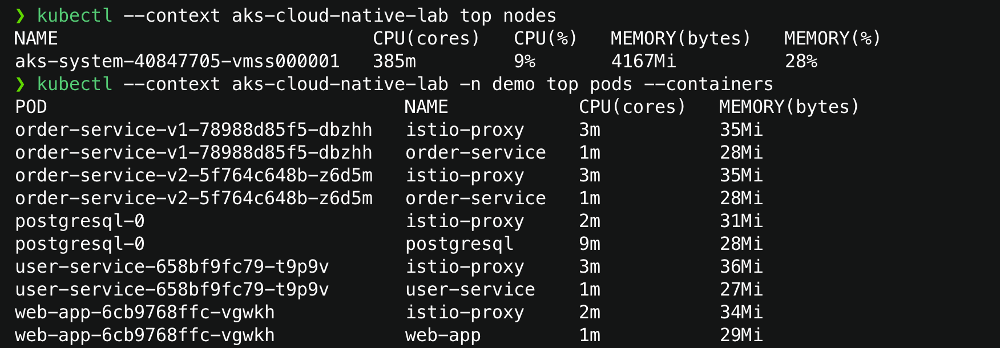

# AKS workload autoscaling ve kaynak optimizasyonu

Bu aşama stateless uygulamaları CPU yüküne göre yatay ölçekler ve VPA ile CPU/memory
request değerleri için salt okunur öneri üretir. PostgreSQL StatefulSet otomatik yatay
ölçekleme kapsamına alınmaz.

## Başlangıç ölçümü

Tek `Standard_D4as_v5` node boşta yaklaşık `385m` CPU ve `4167Mi` memory kullanıyordu.
Uygulama container'ları yaklaşık `1m` CPU ve `27–29Mi` memory tüketirken tanımlı
request değerleri `50m` CPU ve `64Mi` memory idi. PostgreSQL yaklaşık `9m` CPU ve
`28Mi` memory kullanıyordu.



Boşta ölçüm yalnızca başlangıç noktasıdır. Request tuning kararı gerçek trafik,
yoğunluk ve uzun süreli VPA önerileri görülmeden verilmez.

## HPA tasarımı

```text
metrics-server
      │ uygulama container CPU kullanımı
      ▼
HPA ── desired replicas ──► Deployment
```

| HPA | Hedef Deployment | Ölçülen container | Min/Max | Hedef |
| --- | --- | --- | --- | --- |
| `web-app` | `web-app` | `web-app` | 1/2 | CPU %60 |
| `user-service` | `user-service` | `user-service` | 1/2 | CPU %60 |
| `order-service-v1` | `order-service-v1` | `order-service` | 1/2 | CPU %60 |
| `order-service-v2` | `order-service-v2` | `order-service` | 1/2 | CPU %60 |

HPA `autoscaling/v2` ve `ContainerResource` metriği kullanır. Böylece pod toplamı
yerine yalnızca uygulama container'ı ölçülür; Istio proxy CPU tüketimi ölçekleme
kararını bozmaz. `50m` CPU request ve `%60` hedefte yaklaşık `30m` ortalama kullanım
scale-up değerlendirmesini başlatır.

Scale-down stabilization penceresi laboratuvarın hızlı gözlemlenebilmesi için 60
saniyedir. Minimum replica 1 olduğu için trafik kesildiğinde uygulama sıfıra inmez.

Autoscaling açıkken Deployment template'leri `spec.replicas` üretmez. Replica alanı
Git'te sabit kalırsa ArgoCD self-heal ile HPA aynı alanı yönetmeye çalışır; koşullu
render bu ownership çakışmasını önler.

## VPA tasarımı

Terraform, AKS managed VPA controller, updater, admission controller ve recommender
bileşenlerini açar:

```text
workload_autoscaler_profile.vertical_pod_autoscaler_enabled = true
```

Her stateless Deployment için ayrı bir `VerticalPodAutoscaler` bulunur. Bütün VPA
kaynaklarında `updateMode: Off` kullanılır. Bu modda VPA:

- CPU ve memory kullanım geçmişini inceler.
- `lowerBound`, `target` ve `upperBound` önerileri üretir.
- Podları yeniden başlatmaz veya evict etmez.
- Deployment request/limit değerlerini değiştirmez.

Resource policy yalnızca ana uygulama container'ı için CPU ve memory request önerisi
üretir. Wildcard policy `Off` olduğu için Istio sidecar öneriye dahil edilmez.
`controlledValues: RequestsOnly`, ileride aktif moda geçilse bile limit ownership'ini
ayrı tutar.

HPA ve VPA aynı CPU/memory alanlarını aktif biçimde yönetmez: HPA replica sayısını
değiştirir, VPA ise yalnızca tavsiye verir.

## AKS tek-node kapasite notu

Node pool `max_pods=50` ile oluşturuldu. VPA eklentisi HA amaçlı birden fazla sistem
podu ekleyince pod slotları doldu. `max_pods` mevcut node pool'da risksiz bir yerinde
değişiklik değildir; node pool rotation tek node ve 4 vCPU kota sınırında kesinti veya
kota hatası yaratabilir.

Bu nedenle kullanılmadığı doğrulanan bileşenler values üzerinden kapatıldı:

- ArgoCD ApplicationSet controller
- ArgoCD Notifications controller
- Kyverno Cleanup controller

ArgoCD Application sync, Kyverno admission/background scan ve policy report özellikleri
çalışmaya devam eder. Açılan slotlar tek workload üzerinde kontrollü HPA deneyi için
yeterlidir. Bu cluster üretim veya bütün uygulamaların aynı anda burst ettiği bir HA
tasarımı değildir; HPA pod oluşturur ama node oluşturmaz.

## Git ve cluster akışı

Varsayılan chart values dosyalarında HPA/VPA kapalıdır; Minikube etkilenmez.
`values-aks.yaml` dosyaları iki özelliği açar. Terraform önce VPA API'sini cluster'a
ekler, ardından main'e birleşen Helm değişikliklerini ArgoCD otomatik sync eder.

Yerel ve server-side kontroller:

```bash
helm lint helm/user-service --values helm/user-service/values-aks.yaml
helm lint helm/web-app --values helm/web-app/values-aks.yaml
helm lint helm/order-service --values helm/order-service/values-aks.yaml

kubectl --context aks-cloud-native-lab -n demo get hpa,vpa
```

## Kontrollü scale-up testi

Önce Istio gateway için port-forward açılır:

```bash
kubectl --context aks-cloud-native-lab -n istio-system \
  port-forward svc/istio-ingressgateway 18080:80
```

İkinci terminalde HPA ve pod sayıları izlenir:

```bash
kubectl --context aks-cloud-native-lab -n demo get hpa,pods --watch
```

Üçüncü terminalde iki dakika, 30 eşzamanlı ve salt okunur trafik üretilir:

```bash
node tests/aks/load.mjs http://127.0.0.1:18080 120 30
```

Test özellikle var olmayan yüksek bir order ID'sini okur. Akış web-app → order-service
→ PostgreSQL → user-service yolunu çalıştırır fakat sipariş oluşturmaz. Istio 80/20
ağırlığı nedeniyle v1 ve v2 aynı anda veya aynı hızda ölçeklenmek zorunda değildir.

Trafik bittikten ve 60 saniyelik stabilization penceresi geçtikten sonra replica
sayısı tekrar minimum 1'e iner. Node slotu yetersizliğinde HPA `desired` değerini
artırsa bile yeni pod `Pending` olabilir; bu HPA hatası değil cluster kapasite sınırıdır.

## VPA önerilerini okuma

İlk öneri birkaç dakika içinde oluşabilir fakat tuning kararı için en az birkaç saat,
tercihen yaklaşık 24 saatlik temsilî trafik beklenmelidir.

```bash
kubectl --context aks-cloud-native-lab -n demo get vpa

kubectl --context aks-cloud-native-lab -n demo describe vpa \
  order-service-v1-recommendation
```

`Target` mevcut ölçümlere göre tavsiye edilen request, `Lower Bound` güvenli alt sınır,
`Upper Bound` ise yüksek kullanım dönemlerini kapsayan üst tahmindir. Bu değerler
otomatik uygulanmaz; daha sonra Helm values üzerinde insan kararıyla düzenlenir.

## Screenshot rehberi

1. `42-hpa-scale-up.png`: yük testi sürerken `get hpa,pods --watch`; en az bir HPA'nın
   `REPLICAS=2` ve iki hazır pod gösterdiği an.
2. `43-hpa-scale-down.png`: trafik kesildikten sonra aynı HPA ve Deployment'ın tekrar
   bir replica'ya döndüğü ekran.
3. `44-vpa-recommendations.png`: `describe vpa order-service-v1-recommendation`
   çıktısında `Mode: Off` ile lower/target/upper önerilerinin birlikte göründüğü bölüm.
4. İsteğe bağlı Azure Portal: AKS → Configuration/Properties altında VPA'nın etkin
   olduğu görünüm. Subscription ID gibi gereksiz hesap ayrıntıları kırpılmalıdır.
