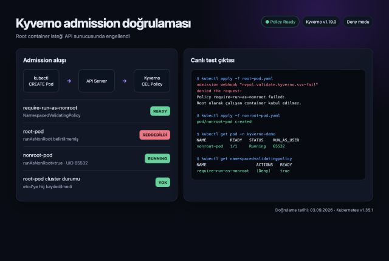

# Kyverno Admission Policy Laboratuvarı

Bu çalışma, güvenlik kurallarının workload çalıştıktan sonra değil Kubernetes API tarafından kabul edilmeden önce uygulanmasını gösterir. Amaç, root çalışabilecek podları reddetmek ve açıkça non-root yapılandırılmış podlara izin vermektir.

## Kurulum

- Ortam: `network-policy-lab` Minikube profili
- Kubernetes: `v1.35.1`
- Kurulum yöntemi: Helm
- Helm chart: `kyverno/kyverno` `3.9.0`
- Kyverno: `v1.19.0`
- Namespace: `kyverno`

Kyverno dört controller ile kuruldu:

- Admission Controller: CREATE ve UPDATE isteklerini webhook üzerinden değerlendirir.
- Background Controller: cluster'da zaten bulunan kaynakları policy'lere göre tarar.
- Reports Controller: policy değerlendirme sonuçlarını raporlar.
- Cleanup Controller: zamanlanmış kaynak temizleme politikalarını uygular.

Bu tek node'lu eğitim ortamında controller başına bir replica kullanıldı. Üretim ortamında admission controller başta olmak üzere controller replica sayıları yüksek erişilebilirlik ihtiyacına göre artırılmalıdır.

## Admission akışı

```text
kubectl / CI / ArgoCD
        │
        ▼
Kubernetes API Server
        │ admission review
        ▼
Kyverno Admission Controller
        │
        ├── policy başarılı ──► kaynak etcd'ye kaydedilir
        │
        └── policy başarısız ─► istek reddedilir, kaynak oluşmaz
```

Bu kontrol image başladıktan sonra yapılmaz. Güvensiz manifest API sunucusuna gönderildiği anda engellenir.

## Neden NamespacedValidatingPolicy?

Policy, güncel CEL tabanlı `policies.kyverno.io/v1` API'si ve `NamespacedValidatingPolicy` türüyle yazıldı. Eski `kyverno.io/v1` altındaki `ClusterPolicy` türü Kyverno 1.19'da deprecated durumdadır.

Namespaced policy yalnızca oluşturulduğu `kyverno-demo` namespace'ini etkiler. Böylece eğitim aşamasındaki bir hata sistem namespace'lerini veya mevcut uygulamaları kilitlemez.

## Policy'nin yaptığı kontroller

[`require-run-as-nonroot.yaml`](../labs/kyverno/policies/require-run-as-nonroot.yaml) aşağıdaki davranışı uygular:

- Pod CREATE ve UPDATE işlemlerini eşleştirir.
- Normal, init ve ephemeral container listelerini tek değişkende birleştirir.
- Pod seviyesinde `runAsNonRoot: true` değerini kabul eder.
- Pod seviyesinde ayar yoksa bütün container'ların ayrı ayrı `runAsNonRoot: true` belirtmesini zorunlu tutar.
- `validationActions: Deny` ile başarısız isteği admission aşamasında reddeder.
- Background değerlendirmesini açık tutar.

Kyverno autogen özelliği aynı kontrolü Deployment, ReplicaSet, StatefulSet, DaemonSet, Job ve CronJob pod template'lerine de genişletir.

## Negatif test: root pod reddedildi

[`root-pod.yaml`](../labs/kyverno/tests/root-pod.yaml) hiçbir `runAsNonRoot` güvencesi belirtmez. Kaynak uygulanmaya çalışıldığında admission webhook isteği reddetti:

```text
admission webhook "nvpol.validate.kyverno.svc-fail" denied the request:
Policy require-run-as-nonroot failed:
Root olarak çalışan container kabul edilmez.
```

`root-pod` cluster'a hiç kaydedilmedi; bu nedenle `Pending` veya `CrashLoopBackOff` durumuna dahi gelmedi.

## Pozitif test: non-root pod kabul edildi

[`nonroot-pod.yaml`](../labs/kyverno/tests/nonroot-pod.yaml) aşağıdaki güvenlik özelliklerini kullanır:

- `runAsNonRoot: true`
- `runAsUser: 65532`
- `runAsGroup: 65532`
- `seccompProfile: RuntimeDefault`
- `allowPrivilegeEscalation: false`
- Bütün Linux capability'lerini düşürme

Pod admission kontrolünden geçti ve `Running / Ready` durumuna ulaştı.

| Test | Beklenen | Gerçek sonuç |
| --- | --- | --- |
| Policy durumu | Ready | `true` |
| root-pod oluşturma | Reddedilir | Webhook tarafından reddedildi |
| root-pod cluster sorgusu | Bulunamaz | Kaynak oluşmadı |
| nonroot-pod oluşturma | Kabul edilir | `Running / Ready` |
| nonroot-pod kullanıcı kimliği | Root dışı UID | `65532` |



## Projedeki dosyalar

- Namespace: [`../labs/kyverno/namespace.yaml`](../labs/kyverno/namespace.yaml)
- Policy: [`../labs/kyverno/policies/require-run-as-nonroot.yaml`](../labs/kyverno/policies/require-run-as-nonroot.yaml)
- Reddedilmesi beklenen test: [`../labs/kyverno/tests/root-pod.yaml`](../labs/kyverno/tests/root-pod.yaml)
- Kabul edilmesi beklenen test: [`../labs/kyverno/tests/nonroot-pod.yaml`](../labs/kyverno/tests/nonroot-pod.yaml)

## Sonuç

NetworkPolicy çalışan podlar arasındaki trafiği sınırlar. Kyverno ise pod henüz oluşmadan manifestin güvenlik şartlarını karşılayıp karşılamadığını denetler. Bu iki kontrol farklı katmanlarda çalışır ve birbirini tamamlar.

## Resmî kaynaklar

- [Kyverno kurulumu](https://kyverno.io/docs/installation/installation/)
- [CEL tabanlı ValidatingPolicy](https://kyverno.io/docs/policy-types/validating-policy/)
- [CEL policy migration rehberi](https://kyverno.io/docs/guides/migration-to-cel/)
