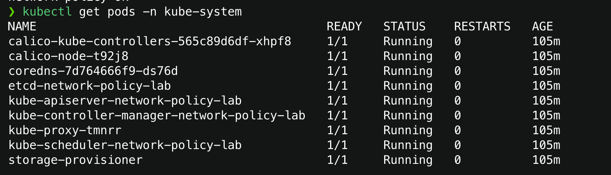
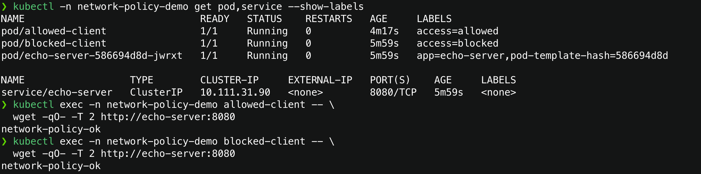
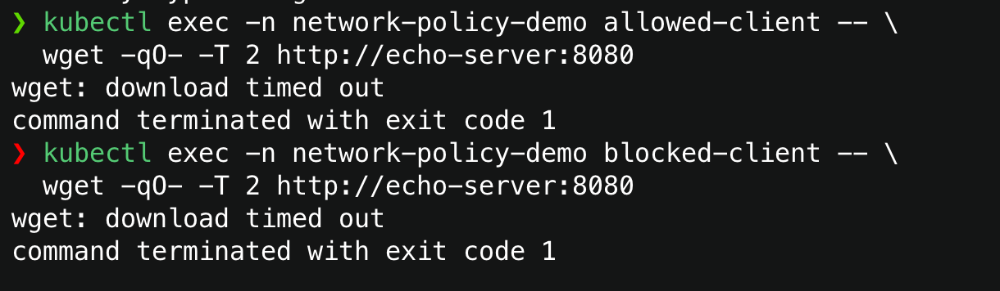
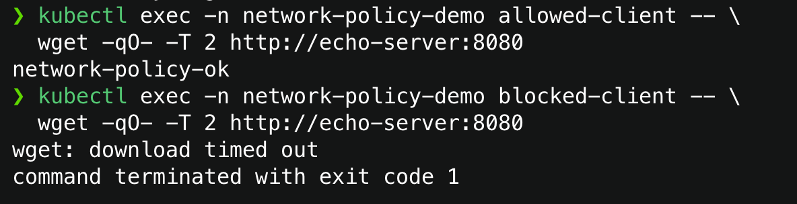
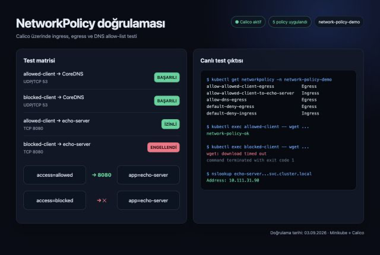

# NetworkPolicy Laboratuvarı

Bu çalışma, Kubernetes ağ trafiğinin varsayılan açık modelden seçici bir allow-list modeline nasıl geçirildiğini gösterir. Testler, NetworkPolicy enforcement desteği bulunan ayrı bir Minikube profili üzerinde gerçekleştirildi.

## Kapsam ve ortam

- Minikube profili: `network-policy-lab`
- CNI: Calico
- Namespace: `network-policy-demo`
- Sunucu: `echo-server`, TCP `8080`
- İstemciler: `allowed-client` ve `blocked-client`

NetworkPolicy kuralları Kubernetes API tarafından saklanır, fakat paketlerin gerçekten engellenmesi CNI tarafından gerçekleştirilir. Bu nedenle varsayılan `bridge` CNI yerine Calico kullanılan ayrı bir profil oluşturuldu. Mevcut uygulama cluster'ı silinmedi; durdurulmuş halde korunmaktadır.



## İlk durum: varsayılan açık trafik

Herhangi bir NetworkPolicy yokken iki istemci de `echo-server` Service'ine erişebildi. `access: allowed` ve `access: blocked` etiketleri tek başına trafik davranışını değiştirmez; etiketler yalnızca policy selector'ları için kimlik sağlar.



## Ingress izolasyonu

`default-deny-ingress`, namespace içindeki bütün podları ingress yönünde izole eder ve boş izin listesi nedeniyle yeni gelen bağlantıları engeller. Sonrasında `allow-allowed-client-to-echo-server`, yalnızca `access: allowed` etiketli poddan `app: echo-server` etiketli poda TCP/8080 erişimini açar.

Policy'ler birbirini ezmez; izin kümeleri birleşir. Sonuç olarak allowed-client erişebilirken blocked-client timeout alır.





## Egress izolasyonu ve DNS

Egress tarafında aşağıdaki üç adım uygulandı:

1. `default-deny-egress` bütün podların yeni çıkış bağlantılarını kapattı.
2. `allow-dns-egress`, yalnızca `kube-system` namespace'indeki `k8s-app: kube-dns` podlarına UDP/TCP 53 trafiğini açtı.
3. `allow-allowed-client-egress`, `access: allowed` podundan `app: echo-server` poduna yalnızca TCP/8080 çıkışına izin verdi.

DNS policy'sindeki namespace ve pod selector'ları aynı peer içinde tanımlandığı için koşullar `AND` mantığıyla değerlendirilir. Böylece kube-system içindeki bütün podlara veya başka namespace'lerde aynı etiketi taşıyan podlara gereksiz erişim verilmez.

## Son doğrulama

| Test | Beklenen | Sonuç |
| --- | --- | --- |
| allowed-client → CoreDNS | DNS çözümleme başarılı | Başarılı |
| blocked-client → CoreDNS | DNS çözümleme başarılı | Başarılı |
| allowed-client → echo-server:8080 | HTTP yanıtı alınır | `network-policy-ok` |
| blocked-client → echo-server:8080 | Bağlantı engellenir | Timeout |



Bağlantının kurulabilmesi için iki tarafın da izin vermesi gerekir:

```text
allowed-client egress TCP/8080
                +
echo-server ingress TCP/8080
                =
network-policy-ok
```

Bu laboratuvar; default-deny, additive allow kuralları, pod/namespace selector kullanımı, ingress-egress yönleri ve DNS istisnasını doğrular. Gerçek uygulama politikalarında aynı model `web-app → order-service → user-service/PostgreSQL` akışına uygulanabilir.

## Kaynaklar

- Laboratuvar workload'ları: [`../labs/network-policy/workloads.yaml`](../labs/network-policy/workloads.yaml)
- Policy dosyaları: [`../labs/network-policy/policies/`](../labs/network-policy/policies/)
