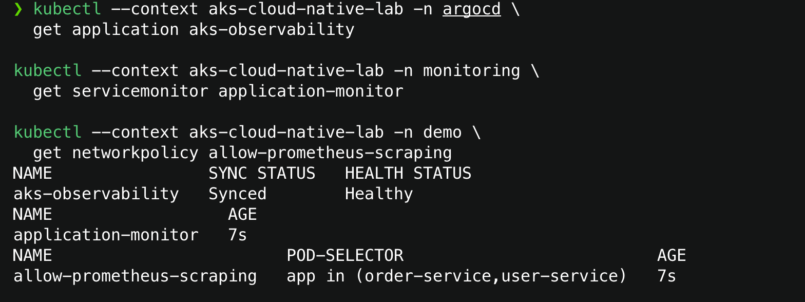
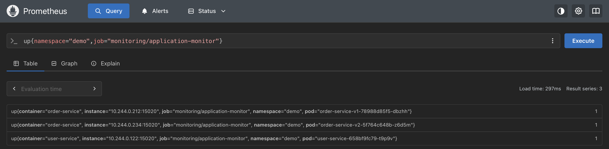
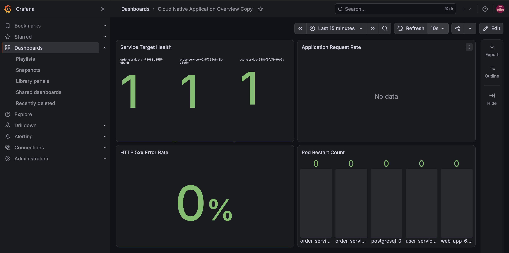

# AKS Observability

Bu aşamada uygulama metrikleri Prometheus tarafından toplanır, Grafana dashboard'u
GitOps ile provision edilir ve temel uygulama alarmları PrometheusRule olarak yönetilir.
Alertmanager bildirimleri Gmail SMTP üzerinden gönderilir. `demo` pod logları Grafana
Alloy tarafından Loki'ye aktarılır ve Grafana Explore üzerinden sorgulanır.

## Veri akışı

```text
user-service / order-service
        │  /metrics
        ▼
Istio metric merge :15020/stats/prometheus
        │
        ▼
PodMonitor → Prometheus → Grafana
                    │
                    └── PrometheusRule → Alertmanager → Gmail SMTP

demo pod stdout/stderr → Alloy → Loki → Grafana Explore
```

Uygulamalar kendi `http_requests_total` ve `http_request_duration_seconds_*`
metriklerini üretir. Istio injection sırasında uygulamanın Prometheus annotation'ları
metric-merge endpoint'ine yönlendirilir. `application-monitor` PodMonitor'ı `demo`
namespace'indeki `user-service` ve `order-service` podlarını seçerek bu endpoint'i
30 saniyede bir scrape eder.

PodMonitor port keşfini pod metadata'sından yaptığı için iki uygulama Deployment'ı
`15020` portunu `istio-metrics` adıyla ilan eder. Bu, uygulamanın 15020 üzerinde yeni
bir sunucu başlattığı anlamına gelmez; pod içindeki ortak ağ alanında Istio agent bu
portu dinler. NetworkPolicy yalnızca `monitoring` namespace'indeki Prometheus podundan
bu porta erişime izin verir.

## Grafana dashboard

`Cloud Native Application Overview` dashboard'u aşağıdaki panelleri içerir:

| Panel | Kaynak | Amaç |
| --- | --- | --- |
| Service Target Health | `up` | Üç uygulama target'ının scrape durumunu gösterir |
| Application Request Rate | `http_requests_total` | Health/metrics dışındaki kullanıcı trafiğinin saniyelik hızını gösterir |
| HTTP 5xx Error Rate | `http_requests_total` | Son beş dakikadaki 5xx yüzdesini gösterir |
| Pod Restart Count | `kube_pod_container_status_restarts_total` | `demo` workload restart sayılarını gösterir |

Dashboard, `grafana_dashboard: "1"` etiketli bir ConfigMap olarak Git'te tutulur.
Grafana sidecar bu ConfigMap'i izler ve dashboard'u otomatik olarak provision eder.
Sabit UID kullanıldığı için yeniden kurulumda yeni bir dashboard kopyası oluşmaz.

## Alarm kuralları

`application-alerts` PrometheusRule üç koşulu değerlendirir:

| Alarm | Koşul | Bekleme | Seviye |
| --- | --- | --- | --- |
| `ApplicationTargetDown` | Uygulama target'ı `up == 0` | 2 dakika | critical |
| `HighHttp5xxRate` | Beş dakikalık 5xx oranı `%5` üzerinde | 2 dakika | warning |
| `DemoPodRestarted` | Son 10 dakikada restart artışı | yok | warning |

`release: monitoring` etiketi, kube-prometheus-stack tarafından yönetilen Prometheus
instance'ının bu kuralı seçmesini sağlar. Alarm üretimi ile bildirim gönderimi farklı
aşamalardır: Prometheus koşulu değerlendirir, Alertmanager ise eşleşen alarmı seçilen
harici alıcıya yönlendirir.

## E-posta bildirim akışı

Gmail parolası Git'te veya AlertmanagerConfig içinde tutulmaz:

```text
Gmail App Password
        │
        ▼
Azure Key Vault: alertmanager-gmail-app-password
        │
        ▼
ExternalSecret: alertmanager-email
        │
        ▼
Kubernetes Secret: demo/alertmanager-email
        │
        ▼
AlertmanagerConfig → smtp.gmail.com:587
```

`platform-email` AlertmanagerConfig yalnızca `team=platform` etiketli ve `demo`
namespace'ine ait alarmları alır. Bildirimler aynı alarm/servis/pod için gruplanır;
ilk mesaj 10 saniye sonra, güncellemeler en erken bir dakika sonra gönderilir. Aynı
alarm çözülmezse dört saatte bir tekrar edilir ve `sendResolved` ile düzelme mesajı
da gönderilir.

## GitOps kaynakları

- [`pod-monitor.yaml`](../gitops/aks-observability/pod-monitor.yaml)
- [`network-policy.yaml`](../gitops/aks-observability/network-policy.yaml)
- [`grafana-dashboard.yaml`](../gitops/aks-observability/grafana-dashboard.yaml)
- [`application-alerts.yaml`](../gitops/aks-observability/application-alerts.yaml)
- [`alertmanager-config.yaml`](../gitops/aks-observability/alertmanager-config.yaml)
- [`alertmanager-email-external-secret.yaml`](../gitops/aks-external-secrets/alertmanager-email-external-secret.yaml)

ArgoCD `gitops/aks-observability` dizinini izler. `main` değiştiğinde yeni dashboard,
alarm kuralları ve scrape ayarları cluster'a otomatik olarak uygulanır.

Loki ve Alloy platform Helm release'leridir. Sürüm sabitleme, kaynak sınırları,
saklama ve güvenlik ayarları Git'teki values dosyalarında yönetilir. Ayrıntılı mimari,
kurulum ve LogQL örnekleri için [`centralized-logging.md`](centralized-logging.md)
belgesine bakın.

## Doğrulama

```bash
kubectl --context aks-cloud-native-lab -n monitoring get podmonitor application-monitor
kubectl --context aks-cloud-native-lab -n monitoring get prometheusrule application-alerts
kubectl --context aks-cloud-native-lab -n monitoring get configmap grafana-dashboard-application-overview
kubectl --context aks-cloud-native-lab -n demo get externalsecret alertmanager-email
kubectl --context aks-cloud-native-lab -n demo get alertmanagerconfig platform-email
```

Prometheus'ta kullanılan temel kontrol sorgusu:

```promql
up{namespace="demo",job="monitoring/application-monitor"}
```

Beklenen sonuç order-service v1, order-service v2 ve user-service için üç adet `1`
değeridir.

## Kanıt ekranları







## Tamamlanan son doğrulamalar

- Kontrollü test alarmı Alertmanager tarafından Gmail alıcısına başarıyla gönderildi.
- Loki API, `demo` namespace'indeki order-service ve user-service JSON loglarını
  uygulama ve pod etiketleriyle döndürdü.
- Alloy `2/2`, Loki `1/1` ve Grafana `3/3` hazır durumda doğrulandı.
